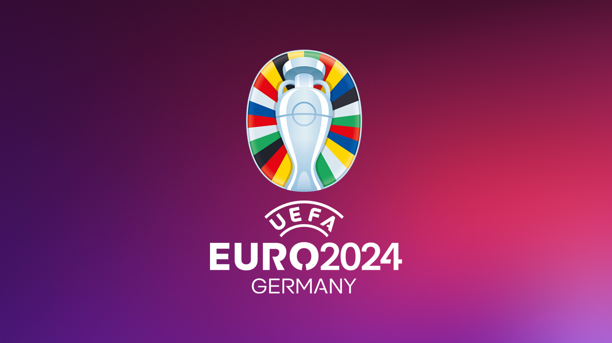

# EURO Germany 2024 - The Sweepstake



## The Draw

- See [the script](euro24_run_euro24_draw.ipynb) that 
generated the draw. 

```python
np.random.seed(14062024) # start date of euro 2024 in DDMMYYYY format
```

## The Draw

| Player    | Team_1                   | Team_2                |
| :-------- | :----------------------- | :-------------------- |
| Adam B    | France (D), rank=1       | Hungary (A), rank=14  |
| Arjun S   | Spain (B), rank=6        | Turkey (F), rank=19   |
| Bec L     | Switzerland (A), rank=10 | Scotland (A), rank=18 |
| Ben B     | Ukraine (E), rank=12     | Albania (B), rank=23  |
| Emily P   | Denmark (C), rank=11     | Serbia (C), rank=16   |
| Grandma B | Italy (B), rank=7        | Czechia (F), rank=17  |
| Grandpa B | Croatia (B), rank=8      | Slovakia (E), rank=21 |
| Jackie B  | Belgium (E), rank=2      | Poland (D), rank=15   |
| Mike L    | Netherlands (D), rank=5  | Slovenia (C), rank=22 |
| Nick B    | England (C), rank=3      | Romania (E), rank=20  |
| Pip L     | Germany (A), rank=9      | Austria (D), rank=13  |
| Sam B     | Portugal (F), rank=4     | Georgia (F), rank=24  |


